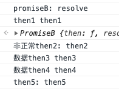
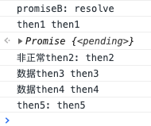

> 精简版promise,有些功能都没有实现，不删除只是为了纪念，不具有参考价值，想看实现请移步 [完整版promise](../完整版promise)

# 简单 promise 的实现

看过很多种 promise 的实现，一直想自己写一个，吭哧了很久，终于写出来了（先不写 all 等方法和 reject 方法，后期在 issues 中补充），就拿它作为第一篇博客吧

## 大纲

1. 先罗列一下可能不全的 promiseA+规范
2. 逆推，从 promise 使用到实现
3. 实现思路和步骤代码
4. 整体代码夹注释
5. 断点式分析

## promiseA+ 规范（从别人文章里看到的，可能不全）

1. promise 需要是一个对象或者函数
2. promise 需要有三个状态 pending，fulfilled,rejected,状态变化只能是 pending 到后两者之一，且不可逆
3. promise 必须有一个 then 方法，该方法接收两个函数参数 onFunfilled 和 onRejected。前者为 pending 到 fulfilled 时执行的方法，后者为 pending 到 rejected 的方法。
4. then 方法必须返回一个新的 promise
5. 确保 then 里面的函数异步执行

## promise 的使用

- 代码

  ```js
  let proB = new PromiseB((resolve) => { console.log('promiseB: resolve'); resolve('then1') })
  proB.then(value => {
    console.log('then1', value)
    return 'then2'
  }).then(//创建pro3
  data => {
    return new PromiseB((resolve) => {//是pro4
      setTimeout(() => {
        console.log('非正常then2:', data)
        resolve('then3')
      }, 1000)
    })
  }).then(value => {
    console.log('数据then3', value)
    return 'then4'
  }).then(value => {
    console.log('数据then4', value)
    return 'then5'
  }).then().then(
    value => { console.log('then5:', value) }
  )
  ```

- 自己实现执行结果：

   >
- promise 执行的结果：

   > 

## 实现思路

- 先看一下使用中需要注意的方面
  1. promise 的函数参数是立即执行的,参数为 resolve,由此开启 promise 逻辑
  2. then 的两个函数参数有可能是同步执行，也有可能是异步执行（**_注：这里分两种情况判断区分异步同步使用 state==='pending'即可_**）
  3. then 可能没有参数
  4. then 参数函数中 return 的数据下一个 then 也得能拿到才可以
- 具体实现思路

  1. 先讲一个概念，链式执行，我在下面一直说同步异步，其实就是当 onFulfilled 返回是一个 promise 的情况下，其后面的调用都应该是在该参数 promise 的 resolve 触发以后才继续执行，而这个 resolve 一般都是在一个异步环境中触发，定时器，接口清求等，所有后面的步骤就有了‘等待’这个过程。
  1. 首先创建一个名为 promiseB 的类接收两个函数参数，该类有一个 then 方法，有一个 state 属性，then 方法接收两个函数参数数 onFunfilled 和 onRejected,then 返回一个新的 promise

  ```js
  class PromiseB{
    constructor(excutor){
    this.state='pending'// 'pending'|'fulfilled'|'redected'
    excutor(this.resolve)
    }
    then=(onFunfilled,onRejected)=>{//class properties语法，目前谷歌浏览器已经支持了
    return new PromiseB(/*这里应该有一个函数参数*/)
    }

  }
  ```

  2.  上面代码中 classProperties 语法就是就是会自动绑定该方法到实例上，相当于 class A{constructor(){this.handleA=this.handleA.bind(this)};handuleA(){console.log('who am I belong to:',this)}}
      onFunfilled 函数参数的参数是 resolve 的数据或者其他 then 的返回值
      then 返回的 promise 的参数下面讲
  3.  除了上述需要的数据以外，excutor 的参数为 **_resolve_** 方法，还需要 **_一个 value 变量_** 来存储每次 onFulfilled 函数接收的参数值。为了满足异步调用的情况，还需要有一个状态去存储需要延后执行的 onFulfilled 函数（一开始准备叫 callbacks，后来发现不贴切，在断点分析中会讲原因），就叫 **_asyncObj_** 吧。

  ```js
   class PromiseB{
    constructor(excutor) {
     this.state='pending'// 'pending'|'fulfilled'|'redected'
     this.value = null
     this.asyncObj = {}
     excutor(this.resolve)
   }
   then=(onFunfilled,onRejected)=>{//class properties语法，目前谷歌浏览器已经支持了
     return new PromiseB(/*这里应该有一个函数参数*/)
   }
   resolve = (newValue) => {}
  }
  ```

  4. 接下来就是实现 then 和 resolve 两个方法，先讲 then 方法，其实主要是讲 then 返回的内部 promise 的逻辑。
     then 方法执行的时候分为同步和异步，即该 promise 的 then 触发的时候，其参数 onfulfilled 的参数 value 能否拿到正确的值，即该 promise resolve 的参数。我们通过 this.state==='pending'来辅助判断，this.state 的修改只能在 resolve 中进行，如果 this.pendin==='pending'为真，那么认为是异步的，先在还不能执行 onFulfilled,讲其存在该 promise 的 asyncObj 中，如果 this.state='pending'为假，那么认为我们已经可以拿到正确的值，为同步，执行 onFulfilled。同时为了保证 promise 可以继续链式调用下去，并且下一个 promise 可以拿到正确值，我们需要在异步时把本次 then 返回的新 promise 的 resolve 存起来，同步则把 onFulfilled(this.value)的结果通过新 promise.resolve 传递出去,如果该 then 没有参数，即没有 onfulfilled,直接 resolve 掉 this.value。至于为何 promise.resolve 可以把数据传递给下一个 promise,我们在 resolve 和断点分析中都会讲。下面是 then 的实现，将上述描述转化成代码：

  ```js
  then = (onFUlfilled) => {
      return new PromiseB(resolve => {
        if (this.state === "pending") {
          this.asyncObj={ onFUlfilled, resolve };
        } else {
          if(!onFUlfilled)return resolve(this.value)
          resolve(onFUlfilled(this.value));
        }
      });
    };
  ```

  5. 实现 resolve 同步方法,这里应该会有一行代码让你相当迷惑，我也是断点调试才彻底搞清楚的
     resolve 是在新创建的 promise 中可以被使用者显式调用的，同时它也是在 then 隐式返回的 promise 中隐式调用的。resolve 首先要接收一个参数 value,然后结合上面 then 讲到的,在 resolve 中要改变 promise 的状态。代码实现(resolve 和 then 同级)

  ```js
  resolve = newValue => {
      this.state = "fulfilled";
      this.value = newValue;
  };
  ```

  6. 实现 resolve 同步和异步方法，上述代码执行同步的代码是没问题了，但是有一个问题，那就是异步的情况下怎么办？结合面 then 方法，then 方法中如果状态没有改变会把 onfullfiled 和新返回的 promise 的 resolve 存到 asyncObj 中，resolve 当然是在正确的时间节点下把他们取出来调用一番啦。至于这个正确的时间节点其实就是当参数 promise 的 resolve 触发以后下一步执行即可。代码至于怎么实现其实就是首先碰见异步或者说 onFulfilled 返回了一个 promise,更确切一点就是当某一个 promise 的 resolve 方法的参数是一个 promise 的时候，**_第一_** 不要去修改这个 promise 的 value,因为我们想要的 value 是参数 promise 调 resolve 返回的值，而不是这个 promise 本身，**_第二_** 不要去修改状态，只要不修改状态，后续执行的所有的 then 都会将 onFulfilled 和新的 resolve 存储到该 promise 的 asyncObj 中而不是去执行它，这就实现了等待的功能，以及保留了以后链式执行的顺序。**_第三_** 当时间节点合适的时候取出 asynObj 中的方法，执行他们。**_第四_**，也是最重要的一步，如果 resolve 的参数 value 是一个 promise，执行这个参数 promise 的 then 方法,并且将本 promise 的 resolve 作为 onfulfilled 传递进去。上述说的时间节点其实就是 resolve 的参数是不是 promise。讲了一堆应该还是没有描述清楚，下面的断点分析会彻底讲清楚，下面是转述代码

  ```js
  resolve = newValue => {
      if (newValue && newValue.then) {
        newValue.then(this.resolve);
      } else {
        this.state = "fulfilled";
        this.value = newValue;
        if(!asyncObj.onFUlfilled && asyncObj.resolve)return asyncObj.resolve(this.value)
        asyncObj.resolve(asyncObj.onFUlfilled(this.value))
      }
    };
  ```

- 全部代码实现：

  ```js
  class PromiseB {
    constructor(excutor) {
      this.state = "pending";
      this.value = null;
      this.asyncObj = {};
      excutor(this.resolve);
    }
    then = onFulfilled =>
      new PromiseB(resolve => {
        if (this.state === "pending")
          return (this.asyncObj = { onFulfilled, resolve });
        if (!onFulfilled) return resolve(this.value);
        resolve(onFulfilled(this.value));
      });
    resolve=value=>{
      if(value&&value.then){
        value.then(this.resolve)
      }else{
        this.state='fulfilled'
        this.value=value
        setTimeout(() => {
            const {onFulfilled,resolve} = this.asyncObj
            if(onFulfilled&&resolve)resolve(onFulfilled(this.value))
            if(!onFulfilled&&resolve)resolve(this.value)
          },
        0);
      }
    }
  }
  ```

## 上面留下几个坑

1. resolve 为什么可以保存链式结构并且让异步以后的代码执行下去?
   > 因为在参数不为 promise 并且 asyncObj 有值的情况下，看第 23 行代码，这里其实是一个递归，onFulfiled 其实就是该 promise 的 then 的参数，resolve 是下个 prommsie 的 resolve。实现了递归遍历数据。
2. 为什么 asyncObj 不叫 callbacks,如果看过其他实现的话，你会发现，大部分人都会叫 callbacks。
   > 其实一般来说，如果真的看懂了上面的代码是不会有这个疑问的，这里并不算是发布订阅， 一般我们发布订阅都是存一系列的 callback,一次 emit,执行所有回调，我们这里是递归，每次执行的时候只有一个之前存好的 onFulfilled 和一个 resolve
3. 参数 promise 的 onfulfilled 为什么是 this.resolve?
   > 这个其实得留到断点分析里去讲，因为篇幅有点长，而且我自己感觉也没有完全搞清楚，我是逆推分析出来的。

## 分析

其实为了搞懂上面那些东西，我用了差不多三天的时间，最后通过编号和打断点才搞清楚地。其实就几个问题，如果都能搞清楚，那你应该对 promise 没有任何疑问了。
>答案在文中，结果在底部

1. 使用示例中总共有几个 promise？
2. 使用示例中总共执行了几次 then，顺序是怎样的？
3. 使用示例中总共执行了几次 resolve，顺序是怎样的？
  
## 断点分析

> 最好先想一下上面的问题，如果答案不对或者没有搞很清楚，带着疑问往下看，收获会更大。生成的第几个promise就记做pro几，例如第一个promise就叫pro1。pro1的onfulfilled就是pro1的then的参数onfulfilled.

1. 第一个promise为pro1，执行 `excutor(resolve)`,即执行 `console.log('promiseB: resolve’)` ，并触发 `pro1.resolve('then1')`，步骤1结束
2. `pro1.resolve('then1')`触发， 判断传入的值是否为promise,值'then1'不是promise：pro1.value改变为pro1.resolve参数'then1',pro1状态改变,执行setTimeout里的代码，因为asyncObj为空，其实啥都不会执行，步骤2结束。
3. pro1.resolve代码块结束以后，示例代码第二行 `proB.then...` 执行,拉开了promise chain的序幕。
`pro1.then(onFulfilled)` 触发，***返回新的promise pro2*** ，判断pro1的状态，通过:执行Pro1的onFulfilled-> `value=>{console.log('then1', value)return 'then2'}`，执行完毕以后获取到返回值'then2',将'then2'作为pro2.resolve的参数，即执行 `pro2.resolve('then2')` ，步骤3结束
4. `pro2.resolve('then2')`触发，判断传入的值是否为promise,值'then2'不是promise：pro2.value改变为pro2.resolve参数‘then2’,pro2状态改变，执行setTimeout里的代码，因为asyncObj为空，其实啥都不会执行，步骤4结束。
5. `pro2.then(onFulfilled)` 触发，***返回新的promise pro3*** ，判断pro2的状态，通过，执行pro2的then的onfulfilled->`data => { return new PromiseB((resolve) => {setTimeout(() => { console.log('非正常then2:', data) resolve('then3') }, 1000) })}`,创建并执行pro4的excutor(resolve)，`setTimeout(() => { console.log('非正常then2:', data) resolve('then3') }, 1000) })`,这个resolve是pro4的，得到返回值 ***一个promise即pro4*** ,将返回值作为value传递给pro3的resolve,执行`pro3.resolve(pro4)`,步骤5结束
6. `pro3.resolve(pro4)` 触发，判断传入的值是否为promise,值 ***pro4*** 是promise：执行 `pro4.then(pro3.resolve)`，步骤6结束。
7. `pro4.then(pro3.resolve)`触发，***返回新的promise pro5***，判断pro4的状态，因为状态的改变都是在this.resolve执行且参数不是promise的情况下才会改变，而pro4.resolve还没有执行，所以 ***不通过*** ：将 ***参数promise即pro4*** 的 ***onfulfilled即pro3的resolve*** 和 ***pro5的resolve*** 存起来,存到 ***参数promise即pro4的asyncObj*** 中，即此时 `pro4.asyncObj={onfulfilled:pro3.resolve,resolve:pro5.resolve}` 。***步骤7结束,执行完毕以后继续回到promise chain,此时应该执行的是*** `pro3.then(onFulfilled)` 
8. `pro3.then(onFulfilled)`触发（我之前的思路一直是卡在步骤7结束）。***返回新的promise pro6*** ，判断pro3的状态，由步骤6可知，不通过：将pro3的onFulfilled-> `(value => {console.log('数据then3', value)return 'then4'})` 和pro6的resolve存到pro3的asyncObj中,即此时`pro3.asyncObj={onfulfilled:pro3.onFulfilled,resolve:pro6.resolve}` ,返回pro6,执行 `pro6.then(onFulfilled)` 步骤8结束。
9. `pro6.then(onFulfilled)`触发，***返回新的promise pro7*** ,判断pro6的状态，和步骤7中pro4对于状态的判断一致，不通过：将pro6的onfulfilled->`value=>{console.log('数据then4', value)return 'then5'}`和pro7的resolve存到pro6的asyncObj中，即此时 `pro6.asyncObj={onfulfilled:pro6.onFulfilled,resolve:pro7.resolve}`,返回pro7,执行`pro7.then(onFulfilled)`，步骤9结束
10. `pro7.then(onFulfilled)`触发，***返回新的promise pro8*** ,判断pro7的状态，和步骤7中pro4对于状态的判断一致，不通过：将pro7的onfulfilled->`undefined`和pro8的resolve存到pro7的asyncObj中，即此时 `pro7.asyncObj={onfulfilled:pro7.onFulfilled,resolve:pro8.resolve}`,返回pro8,执行`pro8.then(onFulfilled)`，步骤10结束
11. `pro8.then(onFulfilled)`触发，***返回新的promise pro9*** ,判断pro8的状态，和步骤7中pro4对于状态的判断一致，不通过：将pro8的onfulfilled->`value => {console.log('then5:', value) }`和pro9的resolve存到pro8的asyncObj中，即此时 `pro8.asyncObj={onfulfilled:pro8.onFulfilled,resolve:pro9.resolve}`,返回pro9,因为pro9没有then,所以 ***没有创建新的pro10*** ，promise chain的then或者说同步过程结束，执行promise chain 以后的逻辑，直到参数promise,即pro4的resolve被触发，才继续执行promise chain,步骤11结束。
12. 致此，所有的then都触发了一遍，执行完成以后总共有 ***6个显式then（每个then都会创建新的promise）+1个初始promise+1个参数promise+1个隐式then(参数promise的then会隐式执行创建一个新的promise)=9个promise***，从上面步骤可得 ***then的执行顺序为：1，2，4，3，6，7，8***  异步之前的前两个promise已经执行完毕, 当前执行的 ***resolve情况为：1，2，3*** ，从参数promise即pro4，触发以后，后面逻辑中的 ***promise.asyncObj中都存储了本promise的onfulfilled和该then返回的新promise的resolve***。需要特别提醒一下的是 ***pro3的asyncObj中存储的是pro的onfulfiled和pro6的resolve，因为pro3.then创建的是pro6*** 。同时，***pro7的asyncObj中存的onfulfilled是undefined***。定时器完成，pro4.resolve('then3')进入队列，等待主栈逻辑执行完毕即触发，步骤12结束
13. `pro4.resolve('then3')`触发，判断传入的值是否为promise,值'then3'不是promise：pro4.value改变为pro4.resolve参数'then3',pro4状态改变,执行setTimeout里的代码，由步骤7可知 `pro4.asyncObj={onfulfilled:pro3.resolve,resolve:pro5.resolve}`。***先执行*** `let nnvalue = onfulfilled('then3')`,得到结果以后执行 `pro5.resolve(nnvalue)`,onfulfilled('then3')触发，onfulfiled为pro3.resolve，即执行 `pro3.resolve('then3')`，但是步骤13其实还没有结束，因为`pro5.resolve(nnvalue)`还没有执行。
14. `pro3.resolve('then3')`触发，判断传入的值是否为promise,值'then3'不是promise：***pro3.value改变为pro3.resolve参数'then3',pro3状态改变*** ,执行setTimeout里的代码，由步骤8可知`pro3.asyncObj={onfulfilled:pro3.onFulfilled,resolve:pro6.resolve}`，但是其实这里还有一步，此时进入setTimeout就是异步执行了，而在步骤13中还有一步没有执行，哪里属于主逻辑，先去执行`pro5.resolve(nnvalue)`，因为`let nnvalue = onfulfilled('then3')===pro3.resolve('then3')`,pro3.resolve('then3')没有返回值，所以nnvalue=undefined, `pro5.resolve(undefined)`执行，判断参数undefined不是promise,修改pro5.value为undefined，修改状态，调出pro5.asyncObj,执行内部函数，由步骤7可知 `pro5.then`未被调用过，所以其asyncObj为空，***至此步骤13结束，但是步骤14仍在继续*** ，等主流程即步骤13结束以后，步骤14setTimeout内的函数开始执行-> let nnvalue=pro3.onFulfilled('then3')-> `let nnValue= (value => {console.log('数据then3', value)return 'then4'})('then3')`,得到nnvalue='then4',然后执行`pro3.asyncObj.resolve(nnvalue)`即 `pro6.resolve('then4')`,其实从13结束以后就开始了递归啦,步骤14结束。
15. `pro6.resolve('then4')`触发，判断参数'then4'是否为promise,不是：修改 `pro4.value='then4'`,修改状态,执行定时器，等待主进程结束，执行定时器内部代码，由步骤9可得 `pro6.asyncObj={onfulfilled:pro6.onFulfilled,resolve:pro7.resolve}` ，pro6.onfulfilled('then4')->`(value=>{console.log('数据then4', value)return 'then5'})('then4')`，然后得到结果nnvalue为 'then5', 执行 `pro6.asyncObj.resolve('then5')`即 `pro7.resolve('then5')`,步骤15结束
16. `pro7.resolve('then5')`触发，判断参数'then5'是不是promise,不是：修改`pro7.value='then5'`,修改状态，执行定时器，等待主进程结束，执行定时器内部代码，由步骤10可得 `pro7.asyncObj={onfulfilled:pro7.onFulfilled,resolve:pro8.resolve}` ，因为pro7.onFulfilled=undefined，执行`pro7.asyncObj.resolve('then5')`即`pro8.resolve('then5')`,步骤16结束
17. `pro8.resolve('then5')`触发，判断参数'then5'是不是promise,不是：修改`pro8.value='then5'`,修改状态，执行定时器，等待主进程结束，执行定时器内部代码，由步骤11可得 `pro8.asyncObj={onfulfilled:pro8.onFulfilled,resolve:pro9.resolve}` ，执行pro8的onfulfilled->`(value => {console.log('then5:', value) })('then5')`，得到 `nnvalue=undefined` 执行`pro8.asyncObj.resolve(undefined)`即`pro9.resolve(undefined)`,步骤17结束
18. `pro9.resolve(undefined)`触发，判断参数undefined是否为promise,不是：修改`pro9.value=undefined`,修改状态，执行定时器，因为pro9.then没有执行过，所以pro9.asyncObj没有值，所以结束。整个promise链也结束。

## 上面问题的答案

1. 共有几个promise,9个
2. 共有几个then,执行顺序：7个，1，2，4，3，6，7，8
3. 共有几个resolve，执行顺序：10个，前3个：1，2，3， 后7个：4，3，5，6，7，8，9
