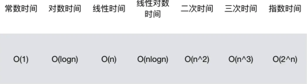

# 复杂度
> 之前一直没怎么搞懂，这次加油啊

## 概念
算法到底做的怎么样，需要有一个依据去衡量。而**时间复杂度**和**空间复杂度**就是这个衡量的两个重要依据

> O(大o表示法)，只看执行做多的那个语句执行了几次

### 时间复杂度

- 只看执行做多的那个语句执行了几次
- 例如最基础的单循环，就记做执行`O(n)`，双循环就是`O(n^2)`
- 一个特殊的例子
  ```js
  function fn(arr) {
    var len = arr.length  
    
    for(var i=1;i<len;i=i*2) {
        console.log(arr[i])
    }
  }
  ```
  循环终止条件`i<len`执行多少次才实现，假设为`i*2`执行了x遍，即`2^x = n`,`x=log2n // 已2为底n的对数`，大O表示法忽略常数2，即为`O(logn)`
- 常见时间复杂度
  

### 空间复杂度

- 常见的空间复杂度有`O(1)`、`O(n)` 和 `O(n^2)`。
- 也是看循环等，对内存的占用，例如一个单循环，想数组插入数据，那就是`O(n)`，二维数组或者说矩阵插入，就是`O(n^2)`